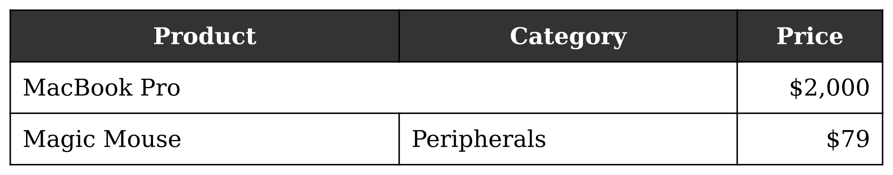

# Table Renderer 📊

<!-- README-I18N:START -->

[English](README.md) | **繁體中文**

<!-- README-I18N:END -->

[](LICENSE)
[](pyproject.toml)
[](https://github.com/pTaunium/table-renderer/actions)
[](https://codecov.io/gh/pTaunium/table-renderer)

`table-renderer` 是一個強大且輕量級的 Python Library，專門用於將結構化表格轉換為高品質的圖片（PNG, JPG, WebP）或 HTML。它結合了 CSS 排版的強大功能與 Python 的易用性，特別適合用於自動化報表、Kubernetes CronJob 任務或任何資料視覺化場景。

## ✨ 特色

- **廣泛的相容性**: 完整支援 **Python 3.12, 3.13 與 3.14**。
- **商業友善**: 使用 `pypdfium2` (Apache-2.0) 和 `WeasyPrint`，擁有 100% 相容 MIT 的依賴鏈。
- **高品質排版**: 基於 WeasyPrint (CSS 引擎)，支援複雜的文字換行、對齊與儲存格合併。
- **自動裁切**: 透過視覺偵測自動將圖片裁切至實際表格範圍，消除不必要的留白。
- **連續長表格支援**: 自動將多個 PDF 頁面拼接成單張連續長圖，防止內容因分頁而被裁斷。
- **物件導向 API**: 簡潔的 `Table` -> `Row/Column` -> `Cell` 階層設計，並支援流暢的鏈式呼叫 (fluent interface)。
- **樣式繼承**: 以「全域預設 + 局部覆蓋」的方式輕鬆管理視覺樣式。
- **多語系字型支援**: 支援字型堆疊 (例如中英文分別使用不同字型)。
- **自訂解析度**: 可調整 DPI 以輸出高解析度圖片 (例如適用於列印的 300 DPI)。
- **輕量化部署**: 不依賴如 Chromium 等重型瀏覽器依賴，非常適合 Docker/K8s 環境。

---

## 🖼 視覺範例

以下是使用[快速開始](#-快速開始)章節中的程式碼所產生的範例表格：



---

## 🚀 快速開始

### 安裝

如果您是在此專案內進行開發，請使用 `uv`：

```bash
uv sync
```

若要在其他專案中安裝：

```bash
pip install .
```

### 基礎用法

```python
from table_renderer import Table

# 1. Initialize a 3x3 table
table = Table(3, 3)
table.set_width(600)
table.set_border(width=1, color="black", style="solid")

# 2. Set header style (Row 0)
header = table.get_row(0)
header.set_background("#333").set_font(color="white", weight="bold", size=16)
header.set_align(horizontal="center")

table.cell(0, 0).set_text("Product")
table.cell(0, 1).set_text("Category")
table.cell(0, 2).set_text("Price")

# 3. Add content and demonstrate merging
table.cell(1, 0).set_text("MacBook Pro").span(rows=1, cols=2)
table.cell(1, 2).set_text("$2,000")

table.cell(2, 0).set_text("Magic Mouse")
table.cell(2, 1).set_text("Peripherals")
table.cell(2, 2).set_text("$79")

# 4. Global column styling (align prices to the right)
table.get_column(2).set_align(horizontal="right").set_width(100)

# 5. Export to image with custom DPI and padding
table.to_image("report.png", dpi=300, padding=20)
```

---

## 🛠 進階功能

### 1. 儲存格合併

使用基於錨點的設計，透過指定起始儲存格與跨度來合併儲存格。

```python
# Merge first row, first two columns (1 row, 2 columns)
table.cell(0, 0).span(rows=1, cols=2).set_text("Merged Header")
```

### 2. 字型管理

載入本地字型檔案並定義字型堆疊 (font stacks) 以實現字元層級的回退 (fallback) 機制。

```python
# Load local font files (.ttf / .otf)
table.add_font("./fonts/Roboto-Regular.ttf")
table.add_font("./fonts/NotoSansTC-Medium.otf")

# Define a font stack: English prefers Roboto, Chinese falls back to Noto Sans
table.set_font(family="Roboto-Regular, NotoSansTC-Medium")
```

### 3. 在儲存格嵌入圖片

您可以輕鬆地將本地圖片或網路圖片 (URL) 嵌入到任何儲存格中。

```python
# 嵌入本地圖片
table.cell(1, 0).set_image("path/to/logo.png", width=50)

# 嵌入網路圖片 URL
table.cell(1, 1).set_image("https://example.com/image.jpg", width=100)
```

### 4. 版面與尺寸

混用固定寬度、百分比以及自動調整大小。

```python
table.set_width(800)                  # Total table width
table.get_column(0).set_width(200)    # Fixed 200px
table.get_column(1).set_width("auto") # Distribute remaining space
```

**處理極寬的表格：**
本套件會動態估算畫布寬度以防止裁斷。然而，如果您的表格包含不可換行的長字串（如超長 URL），且完全依賴自動排版，您可以手動覆蓋畫布寬度。不用擔心設定得太大，自動裁切功能會完美修剪多餘的留白。

```python
# 強制設定巨大的畫布寬度；自動裁切會乾淨地修剪多餘邊距
table.set_width(15000)
table.to_image("wide_table.png")
```

### 5. DPI、格式與留白

微調您的輸出圖片品質與邊距。

```python
# High-res JPG with custom 20px padding
table.to_image("output.jpg", dpi=300, padding=20)

# 設定純白背景的 PNG (覆蓋預設的透明背景)
table.to_image("output_white.png", background_color="white")

# Lightweight WebP with tight margins
table.to_image("output.webp", dpi=72, padding=0)
```

---

## 🐳 Docker / Kubernetes 部署

由於 `weasyprint` 依賴系統層級的 C 函式庫，您的 Dockerfile 應包含以下依賴：

```dockerfile
FROM python:3.12-slim

# Install system dependencies for WeasyPrint rendering and fonts
RUN apt-get update && apt-get install -y --no-install-recommends \
    libpango-1.0-0 \
    libpangoft2-1.0-0 \
    libharfbuzz-subset0 \
    fonts-noto-cjk \
    && rm -rf /var/lib/apt/lists/*

WORKDIR /app
COPY . .
RUN pip install .

CMD ["python", "main.py"]
```

---

## 🧪 開發

### 執行測試

我們使用 `pytest` 進行測試。請確保您已安裝開發所需的依賴。

```bash
uv run pytest --cov=src/table_renderer tests/
```

### 程式碼檢查與格式化

我們使用 `ruff` 來維持程式碼品質。

```bash
uv run ruff check .
uv run ruff format .
```

---

## 🤝 貢獻

歡迎貢獻！如果您發現了錯誤或有功能請求，請開啟 issue 或是提交 pull request。

1. Fork 本專案
2. 建立您的 Feature Branch (`git checkout -b feature/AmazingFeature`)
3. 提交您的變更 (`git commit -m 'Add some AmazingFeature'`)
4. 將變更推送到 Branch (`git push origin feature/AmazingFeature`)
5. 開啟 Pull Request

---

## 📜 授權條款

基於 MIT 授權條款散佈。詳細資訊請參閱 [`LICENSE`](LICENSE)。
